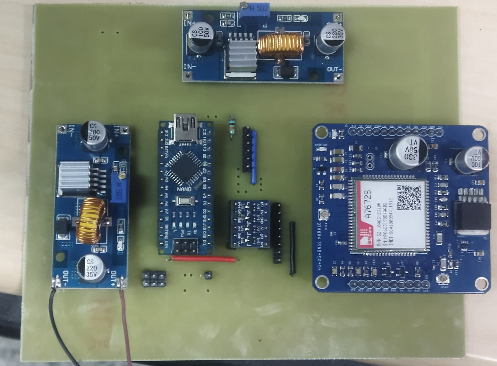
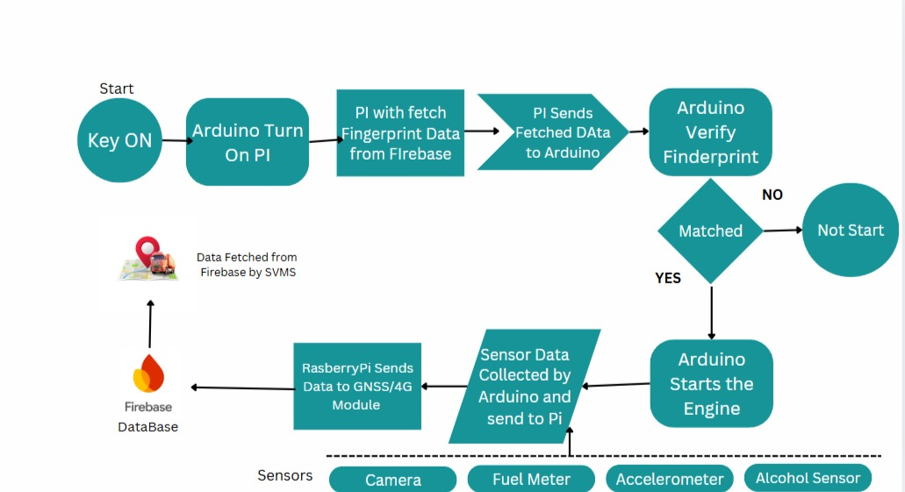

# Smart Vehicle Tracking & Security System

## Overview

This project implements a comprehensive vehicle security and tracking system using a Raspberry Pi and an Arduino Nano. It integrates biometric authentication, alcohol detection, and real-time GPS tracking to enhance vehicle safety and security. The system verifies the driver's identity via a fingerprint sensor and checks for alcohol intoxication before allowing the vehicle's ignition to be turned on.

All relevant data, including real-time location, fuel level, alcohol sensor readings, and system status, is continuously uploaded to a Google Firebase backend, allowing for remote monitoring and data logging. The system is designed to be robust, with automatic startup on boot and data handling for both live tracking and historical analysis.

## Image



## Flow Chart


## Features

-   **Real-time GPS Tracking**: Utilizes a SIMA7672S module to track the vehicle's location (latitude, longitude) and speed in real-time.
-   **Biometric Ignition Control**: Employs an Adafruit fingerprint sensor to ensure only authorized users can start the vehicle.
-   **Drunk Driving Prevention**: An integrated alcohol sensor (MQ-3 type) measures the driver's breath alcohol level. If it exceeds a preset threshold, the ignition is disabled, and an alarm is triggered.
-   **Remote Data Monitoring**: Securely sends all sensor data to a Google Firebase project.
    -   **Firebase Realtime Database**: For live tracking of the vehicle's current location and status.
    -   **Google Firestore**: For storing historical time-series data for later analysis.
-   **Fuel Level Monitoring**: An analog sensor keeps track of the vehicle's fuel level.
-   **System Status Indicators**: A status LED and a buzzer provide instant feedback on the system's state, such as fingerprint verification, errors, or alcohol detection.
-   **Robust and Autonomous**: The system runs automatically on boot, thanks to a systemd service on the Raspberry Pi, and is designed to run continuously.
-   **Data Management**: Automatically archives daily tracking data and includes a mechanism to delete logs older than 100 days to manage cloud storage.

## System Architecture

The system is built around a two-processor architecture to efficiently handle real-time tasks and complex operations.

1.  **Arduino Nano (Low-Level Controller)**: The Arduino is responsible for all real-time I/O operations. It directly interfaces with the fingerprint sensor, alcohol sensor, fuel level sensor, ignition relay, key switch, buzzer, and status LED. It executes immediate commands and reports data to the Raspberry Pi.

2.  **Raspberry Pi (High-Level Processor)**: The Raspberry Pi acts as the main brain. It communicates with the Arduino via serial (UART) to receive sensor data and send high-level commands (e.g., the valid fingerprint ID to check against). It manages the SIMA7672S module to get GNSS data and to connect to the internet via 4G. It also handles all communication with the Firebase backend, formatting data into JSON, and sending it to the cloud.

3.  **Firebase Backend (Cloud)**:
    -   **Firestore** stores vehicle configuration (like the authorized fingerprint ID) and historical tracking data logs.
    -   **Realtime Database** is used to update the vehicle's latest location for a live-tracking dashboard.

## Hardware Requirements

-   **Processors**:
    -   Raspberry Pi (3/4 or newer recommended)
    -   Arduino Nano
-   **Sensors**:
    -   Adafruit Optical Fingerprint Sensor (or compatible R307/R503)
    -   MQ-3 Alcohol Sensor Module
    -   Analog Fuel Level Sensor
-   **Modules**:
    -   SIMA7672S 4G/GNSS Module
    -   5V Single Channel Relay Module
-   **Actuators & Indicators**:
    -   5V Buzzer
    -   5mm LED (any color)
-   **Other Components**:
    -   Vehicle Key Switch
    -   Logic Level Shifter (recommended for 5V Arduino to 3.3V Raspberry Pi serial communication)
    -   Resistors, Jumper Wires, Breadboard/PCB
    -   Appropriate power supply (e.g., a 12V to 5V DC-DC buck converter for in-vehicle use)

## Software & Libraries

### Arduino Nano

-   [Arduino IDE](https://www.arduino.cc/en/software)
-   Libraries:
    -   `SoftwareSerial` (built-in)
    -   [Adafruit Fingerprint Sensor Library](https://github.com/adafruit/Adafruit-Fingerprint-Sensor-Library)

### Raspberry Pi

-   **OS**: Raspberry Pi OS (or other Debian-based Linux)
-   **Language**: Python 3
-   **Libraries** (install via pip):
    -   `pyserial`: `pip3 install pyserial`
-   **Custom Library**:
    -   `SIMA7672S.py`: This is a custom driver library for the SIM module, which must be present in the same directory as the main script.

### Cloud

-   A [Google Firebase](https://firebase.google.com/) project with:
    -   Firestore Database enabled.
    -   Realtime Database enabled.

## Setup & Installation

### 1. Firebase Setup

1.  Create a new project in the [Firebase Console](https://console.firebase.google.com/).
2.  In the project dashboard, go to **Firestore Database** and create a new database in production mode.
3.  Go to **Realtime Database** and create a new database.
4.  **Firestore Data Structure**:
    -   Create a collection named `vehicles`.
    -   Inside `vehicles`, create a document with your `VEHICLE_ID` (e.g., `XYZ789`).
    -   In this document, create a field `VehicleDetails` of type `map`.
    -   Inside `VehicleDetails`, add the following fields:
        -   `assignedTo` (type `number`): The authorized fingerprint ID (e.g., 1).
        -   `FingerprintSensorAddress` (type `number`): The address of your sensor (default is `4294967295`).
5.  Update the Python script (`RPi+Arduino.py`) with your Firebase project details:
    ```python
    PROJECT_ID = "your-firebase-project-id"
    VEHICLE_ID = "your-vehicle-id"
    ```

### 2. Arduino Setup

1.  Open the Arduino IDE and install the `Adafruit Fingerprint Sensor Library` from the Library Manager.
2.  Open the `Arduino Nano.ino` sketch.
3.  Connect the Arduino Nano to your computer and upload the sketch.

### 3. Raspberry Pi Setup

1.  **Enable Serial Port**:
    -   Run `sudo raspi-config`.
    -   Go to `Interface Options` -> `Serial Port`.
    -   Select **NO** for "Would you like a login shell to be accessible over serial?".
    -   Select **YES** for "Would you like the serial port hardware to be enabled?".
    -   Reboot the Raspberry Pi. The primary hardware UART will now be available on `/dev/ttyAMA0` (or a different port like `/dev/ttyAMA3` as used in the script, depending on your setup and Pi model).
2.  **Install Python Library**:
    ```bash
    pip3 install pyserial
    ```
3.  **Place Project Files**:
    -   Copy the `RPi+Arduino.py` and the custom `SIMA7672S.py` library to a directory on your Raspberry Pi (e.g., `/home/pi/vehicle_tracker`).
4.  **Setup Automatic Execution Service**:
    -   Create a systemd service file to run the script automatically on boot.
        ```bash
        sudo nano /etc/systemd/system/vehicle_tracker.service
        ```
    -   Paste the following content into the file. **Make sure to update the `ExecStart` path to match your script's location.**
        ```ini
        [Unit]
        Description=Smart Vehicle Tracker Service
        After=multi-user.target

        [Service]
        Type=simple
        ExecStart=/usr/bin/python3 /home/pi/vehicle_tracker/RPi+Arduino.py
        Restart=always
        User=root

        [Install]
        WantedBy=multi-user.target
        ```
    -   Enable and start the service:
        ```bash
        sudo systemctl enable vehicle_tracker.service
        sudo systemctl start vehicle_tracker.service
        ```

## Wiring Guide

Ensure all components share a common ground (GND). Use a logic level shifter for UART communication between the 5V Arduino and 3.3V Raspberry Pi to prevent damage.

| Arduino Pin | Component | Connection Details |
| :--- | :--- | :--- |
| **A0** | Alcohol Sensor | Analog Out (AOUT) Pin |
| **A1** | Fuel Level Sensor | Analog Out Pin |
| **D2 (`WAKEUP_PIN`)**| Raspberry Pi | A GPIO pin on the RPi (for future wake-up implementation) |
| **D3 (`KEYIN`)** | Key Switch | Output from the key switch (ACC position) |
| **D5 (`RPi TX`)** | Raspberry Pi RX | Via Logic Level Shifter (Arduino TX -> RPi RX) |
| **D6 (`RPi RX`)** | Raspberry Pi TX | Via Logic Level Shifter (Arduino RX -> RPi TX) |
| **D7 (`BUZZER`)** | Buzzer | Positive (+) lead of the buzzer |
| **D8 (`IGNITION`)**| Relay Module | IN (Signal) pin of the relay |
| **D9** | Fingerprint Sensor| RX pin of the sensor |
| **D10** | Fingerprint Sensor| TX pin of the sensor |
| **D11 (`TCH_PIN`)** | Fingerprint Sensor| Touch/Detect output pin of the sensor |
| **D12 (`STATUSLED`)**| Status LED | Positive (+) lead of the LED (via a resistor) |

-   **Raspberry Pi to SIMA7672S**: Connect via UART according to the module's documentation. The Python script will communicate with it through a serial port (e.g., `/dev/ttyAMA3`).
-   **Ignition Relay**: The relay's COM and NO (Normally Open) terminals should be connected in series with the vehicle's ignition wire.

## How to Use

1.  **Enroll Fingerprints**: Use the example sketches from the Adafruit Fingerprint library to enroll the authorized user's fingerprint. Note the ID number (e.g., 1). Update this ID in your Firestore database (`assignedTo` field).
2.  **Power On**: Turn the vehicle key to the accessory (ACC) position. This powers up the entire system.
3.  **Initialization**: The Raspberry Pi boots, runs the script, connects to the internet, and fetches the valid fingerprint ID from Firebase. It then sends this ID to the Arduino.
4.  **Verification**: The system is now ready. The status LED will turn ON, indicating it's waiting for a fingerprint.
    -   Place your finger on the sensor.
5.  **Start Engine**:
    -   **Success**: If the fingerprint is valid and the alcohol sensor reads below the threshold, the ignition relay is activated. You can now fully start the engine.
    -   **Invalid Finger**: The ignition remains disabled.
    -   **Alcohol Detected**: The buzzer will sound, and the ignition will be disabled, regardless of the fingerprint scan.
6.  **Monitoring**: While the system is on, it will continuously send tracking and sensor data to Firebase every 5 minutes (`sleep_time = 300`).
7.  **Power Off**: Turning the key to the OFF position will cut power to the system and de-energize the ignition relay.

## Notes

-   **Security**: Ensure you set up proper [Firebase Security Rules](https://firebase.google.com/docs/rules) to protect your database from unauthorized access.
-   **Logging**: The Python script creates daily log files in an `output/` directory and a raw data log in a `log/` directory on the Raspberry Pi. This is useful for debugging.
-   **Customization**: Thresholds like `ALCOHOLTHRESHOLD` and timings like `REPORT_INTERVAL` can be easily adjusted in the Arduino code. The data upload interval (`sleep_time`) can be changed in the Python script.

## License
This project is licensed under the MIT License. See the [LICENSE](LICENSE) file for details.